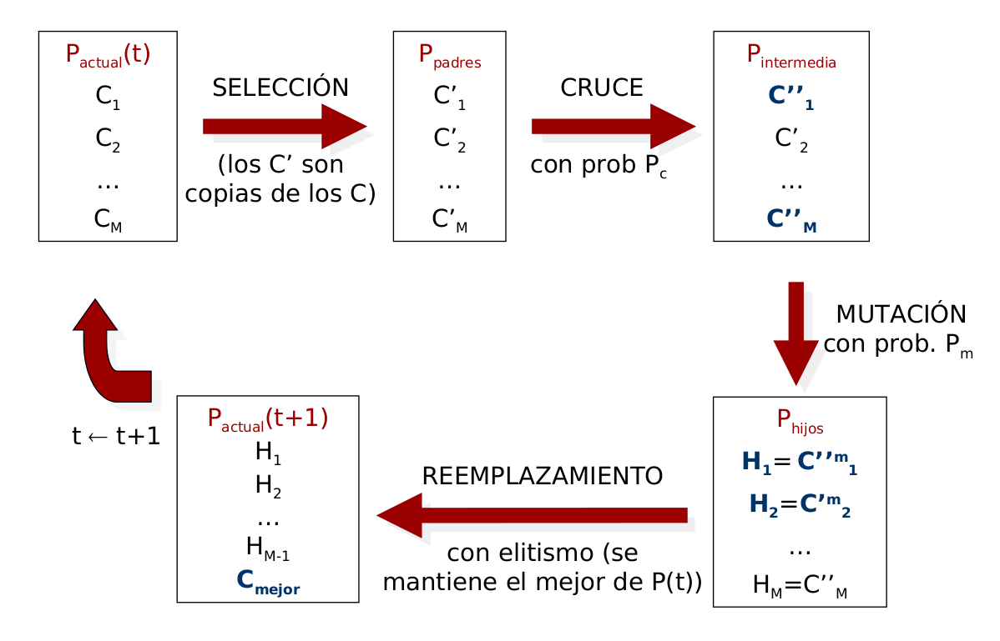
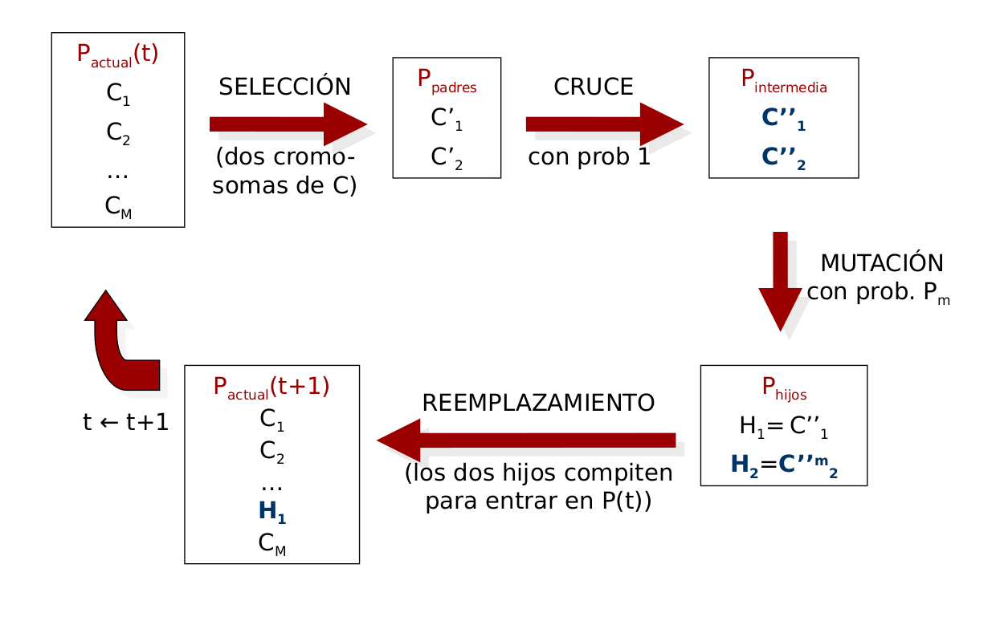

# Descripción del problema APC.

El problema que trataremos es el APC (Aprendizaje de Pesos en Características). Antes de explicar el problema tendremos en cuenta los siguientes puntos: 

- Conjunto de datos: Utilizaremos tres bases de datos que se explicarán más adelante y se representarán como usa sucesión de elementos sobre los cuales se han llevado a cabo una serie de mediciones o se aporta una serie de características y tienen asociada una etiqueta. Por lo tanto estamos en el ámbito de problemas de Aprendizaje Supervisado.
- Clasificador: Utilizaremos el clasificador de los K vecinos más cercanos con K=1 para clasificar ejemplos, de esta manera la etiqueta que asignaremos al ejemplo que clasificamos será la del elemento más cercano a él en el conjunto de datos del que disponemos.
- Distancia: Para medir la distancia entre elementos del conjunto usaremos la distancia euclídea ponderada: 
$$d(e_1,e_2)=\sqrt{\sum_i{w_i(e_1^i-e_2^i)^2}}$$
Como podemos ver, cada elemento del sumatorio viene multiplicado por una constante $w_i$. 

De esta manera, establecido el contexto del problema, nuestro objetivo será hallar ese vector $w$ de pesos que dará prioridad a unos atributos sobre otros, para ello usaremos diversas técnicas aprendidas en clase.

Por lo tanto, el APC es un problema que pretende optimizar el rendimiento del clasificador KNN.

\newpage 

# Descripción de la aplicación de los algoritmos.

## Métricas 

En todos los algoritmos que empleemos vamos a utilizar un clasificador 1-NN (como se dijo anteriormente). De esta forma las métricas que usaremos para comprobar la bondad del vector de pesos $w$ obtenido por cada algoritmo serán: 

- **Tasa de clasificación**: que medirá el porcentaje de instancias correctamente clasificadas aplicando validación sobre el conjunto T de datos correspondiente (lo haremos generalmente sobre el conjunto de datos que usamos para entrenar). Su expresión es la siguiente: 
    $$tasa_{clas}=100·\frac{n \; instancias \; bien \; clasificadas \; en \; T }{n \; instancias \; en \; T}$$

- **Tasa de reducción**: medirá el porcentaje de características descartadas, es decir, aquellas cuyo peso esté cercano a 0. Pondremos el umbral en 0.1. Su expresión es la siguiente: 
  $$tasa_{red}=100·\frac{n \; valores \; < \; 0.1 \; en \; W }{n \; caracteristicas}$$

Finalmente, las dos métricas anteriores se combinarán en la que será nuestra **función objetivo**, que intentaremos maximizar, y que tiene como expresión la siguiente:

$$F(W)=\alpha⋅tasa_{clas}(W)+(1− \alpha)⋅tasa_{red}(W)$$

En nuestro aso $\alpha=0.5$ de manera que daremos la misma importancia a la tarea de reducción como la de clasificación. 

## Validación Cruzada

Por otro lado, como sabemos de las técnicas de Aprendizaje Automático, para diseñar un clasificador, es necesario realizar dos tareas: **Aprendizaje y Validación**.

De esta forma, el conjunto de los ejemplos que tratamos se divide en dos, en conjunto de entrenamiento (que usaremos para entrenar el clasificador) y en el conjunto de Validación (que lo usaremos para validarlo). 

Para mayor seguridad y garantías de generalización, se suelen realizar varias particiones Entrenamiento-Validación sobre los datos originales, es por ello que nosotros usaremos la técnica denominada **Cross Validation 5-Fold**, que consiste en los siguiente: 

- El conjunto de datos se divide en 5 partes (5-fold) disjuntas al 20% con distribución de clases equilibrada. 
- Aprendemos un clasificador con el 80% de los datos (es decir, con 4 de las 5 particiones) y se valida en el 20% restante (la partición que no hemos usado). Esto lo realizaremos 5 veces cambiando cada vez el conjunto de validación.
- De esta manera obtenemos 5 valores distintos de pocentaje de clasificación, por lo que para medir la calidad del método se realizará la media de los 5 obtenidos. 
- Lo explicado anteriomente es el método general, pero en nuestro caso en cada iteración obtendremos un resultado de $tasa_{clas}$, $tasa_{red}$, del tiempo de ejecución del algoritmo y de la función objetivo. Por lo que nosotros al final promediaremos todas estas cantidades para obtener la bondad de nuestro clasificador final.

## Clasificador KNN

Finalmente, como ya se ha comentado, usaremos el **clasificador KNN** con K=1, por lo que en esta última parte de la sección vamos a explicar algunos detalles del clasificador.

El proceso de aprendizaje consiste en mantener en memoria una tabla con los ejemplos de entrenamiento junto con la clase que tienen asociada, de esta forma, dado un nuevo ejemplo se calculará la distancia con los n elementos de la tabla y se escogen los k elementos más cercanos, de esta forma la clase que asignaremos al nuevo ejemplo sería la mayoritaria entre estas k clases. En nuestro caso como K=1 se simplifica el procesp, pues asignamos la clase del elemento más cercano.

La descripción en Pseudocódigo sería: 

```c++
Clasificador1NN(datos, elemento):
  cmin=clase del primer elemento en entrenamiento e1
  dmin=distancia entre e1 y el nuevo ejemplo

  Para i=2 hasta m hacer: 
    Se calcula la distancia entre ei y el nuevo ejemplo.

    Se comprueba si la nueva distancia es menor que dmin: 
      - Si es menor se elige cmin=clase de ei y se actualiza dmin.
      - Si no es menor se continúa.
Devolver cmin.
```
Por otro lado la distancia que usaremos para el clasificador será la comentada en el apartado anterior, que denominaremos **distancia euclídea ponderada**, recordamos su expresión:
$$d(e_1,e_2)=\sqrt{\sum_i{w_i(e_1^i-e_2^i)^2}}$$

Finalmente usaremos dos técnicas diferentes para comprobar la precisión de nuestro clasificador según nos encontremos en la fase de entrenamiento o la de validación en cada partición realizada en el 5-Fold Cross Validation:

- Entrenamiento: Usaremos el método **Leave One Out**, su pseudocódigo es el siguiente: 

  ```c++
  LeaveOneOut(Entrenamiento):
    Para cada elemento e en Entrenamiento: 
      etiqueta_predicha=Clasificador1NN(Entrenamiento-{e},e)

      Si etiqueta_predicha=etiqueta_real de e
        correctos ++
    
    return 100*(correctos/num_datos)
  ```
  Es decir, en cada paso eliminamos un elemento del conjunto de datos de entrenamiento y tratamos de clasificarlo, si las etiquetas predicha y real coinciden sumamos un acierto, si no se continúa. Finalmente se devuelve el porcentaje de acierto.

- Validación: En este caso método será intentar clasificar cada elemento del conjunto de validación usando los del conjunto de entrenamiento: 
  ```c++
  Evaluacion(Entrenamiento, Validacion):
    Para cada elemento e en Validacion: 
      etiqueta_predicha=Clasificador1NN(Entrenamiento,e)

      Si etiqueta_predicha=etiqueta_real de e
        correctos ++
    
    return 100*(correctos/num_datos)
  ```

Para este método es muy importante que los datos estén normalizados entre [0,1] para no priorizar unos atributos sobre otros. Por ello, para cualquier conjunto de datos que utilicemos, lo primero que se hará será normalizar los datos y mezclarlos (para evitar que las clases estén desbalanceadas). El algoritmo para normalizar es el siguiente: 

```c++
Normalizar(Datos):
  Para cada atributo a: 
    Se calcula el máximo y mínimo de entre todos los datos

    Para cada elemento del conjunto de datos: 
      Cambiar valor de atributo a por (x-min)/(max-min)
```

### Bases de datos a usar

Las bases de datos que utilizaremos son: 

- **Ionosphere**: datos de radar recogidos por un sistema en Goose Bay, Labrador. Los objetivos eran electrones libres en la ionosfera. Los
"buenos" retornos de radar son aquellos que muestran evidencia de algún tipo de estructura en la ionosfera. Los retornos "malos" son aquellos que no lo hacen. 

  Tiene 352 ejemplos con 34 atributos (señales procesadas) y 2 clases (good o bad).

- **Parkinsons**:contiene datos para distinguir entre lapresencia y la ausencia de la enfermedad de Parkinson en una serie de pacientes a partir de medidas biomédicas de la voz. 
  Tiene 195 ejemplos con 23 atributos (incluyendo la clase). Las clases están desbalanceadas (147 enfermos 48 sanos). Algunos atributos son: Frecuencia mínima, máxima y media de la voz, medidas absolutas y porcentuales de variación de la voz, medidas de ratio de ruido en las componentes tonales.

- **Spectf-heart**:contiene atributos calculados a partir de imágenes médicas de tomografía computerizada (SPECT) del corazón de pacientes humanos. La tarea consiste en determinar si la fisiología del corazón analizado es correcta o no.
  Tiene 267 ejemplos, 45 atributos (incluyendo la clase) y 2 clases (sano o con patología).

\newpage 
## Detalles técnicos

En nuestro problema, el conjunto de datos se va a representar por medio de un vector de pares (atributos, etiqueta). 

El esquema de representación de soluciones será un vector de doubles que representará el vector de pesos $w$ solución, de manera que si una característica tiene asociado un peso de 1, significa que se considera completamente en el cálculo de la distancia, si tiene un 0.1 o menos no se considera y para cualquier otro valor intermedio pondera la importancia del atributo que tiene asociado.


# Descripción de los Métodos de Búsqueda

En esta sección vamos a describir las distintas técnicas que emplearemos para resolver el problema APC. 

## Algoritmo RELIEF

Se trata de un algoritmo Voraz (greedy) de búsqueda secuencial, en el cual se parte de un vector de pesos inicializado a 0 que incrementa cada componente en función del enemigo más cercano a cada ejemplo y la reduce en función del amigo más cercano a cada ejemplo. 

Entendemos el enemigo más cercano como el elemento más próximo al que estemos considerando que tiene asociada una clase distinta a la suya. Del mismo modo consideramos el amigo más cercano como aquel que es más próximo al elemento que estamos considerando y tiene misma clase asociada.

La implementación del algoritmo es la siguiente en pseudocódigo: 

```c++
RELIEF(Entrenamiento,w):
	Inicializamos w a 0

	Para cada elemento e en el conjunto de entrenamiento E:
    se calcula distancia componente a componente al enemigo más cercano de e en E
    se calcula distancia componente a componente al amigo más cercano de e en E
    se calcula w=w+distancia_enemigo-distancia_amigo componente a componente

  Normalizamos w

  return w
```

Por su lado las implementaciones para las funciones que calculan las distancias al enemigo y amigo más cercano son las siguientes: 

```c++
DistanciaEnemigoMasCercano(Entrenamiento,a):
  elemento de entrada a
  dmin=distancia euclídea entre a y el primer elemento de entrenamiento
  distancia=0

  Para cada elemento e en entrenamiento E:
    distancia=distancia euclídea entre e y a
    
    Si distancia < dmin && clase de e!= clase de a
      dmin=distancia
      enemigo_mas_cercano=e 

  Calculamos distancias componente a componente entre a y enemigo_mas_cercano

  return distancias_componente_componente
```

Para el amigo más cercano sería:

```c++
DistanciaAmigoMasCercano(Entrenamiento,a):
  elemento de entrada a
  dmin=distancia euclídea entre a y el primer elemento de entrenamiento
  distancia=0

  Para cada elemento e en entrenamiento E:
    distancia=distancia euclídea entre e y a
    
    Si distancia < dmin && clase de e== clase de a
      dmin=distancia
      amigo_mas_cercano=e 

  Calculamos distancias componente a componente entre a y amigo_mas_cercano

  return distancias_componente_componente
```

En el código, la estructura de datos que hemos empleado han sido los vectores de la STL. Además hemos tenido que sobrecargar los operadores de suma y resta para realizar sumas y restas componente a componente entre dos vectores.

\newpage

## Algoritmo de Búsqueda Local

En segundo lugar hemos empleado la técnica de búsqueda por trayectorias simples para implementar el algoritmo de **búsqueda local del primer mejor**.

Antes de describir el algoritmo vamos a aclarar algunos puntos necesarios para su comprensión: 

- Definimos el entorno de una solución $w$ como el conjunto formado por las solucuiones accesibles desde ella a través de un movimiento, que en nuestro caso será una mutación de una componente del vector $w$ por medio de un valor aleatorio generado por una Distribución normal de media 0 y desviación típica $\sigma=0.3$.
  $$Mov(W, \sigma)=W'=(w_1,...,w_i+z_i,...,w_n)$$
  $$z_i\sim N(0,\sigma^2)$$

- Para asegurarnos de que tras aplicar una mutación, nuestro vector resultante siga cumpliendo las restricciones del problema debemos truncar la componente modificada para que su valor se encuentre entre [0,1].
  
El tamaño del entorno de cada solución es infinito por ser un problema de codificación real. Para solucionar este problema vamos a mutar cada componente del vector $w$ en un orden aleatorio y sin repetición hasta que **haya mejora en la función objetivo** o se hayan mutado todas las componentes. Si se produce mejora aceptamos la solución vecina y comenzamos de nuevo. Si no se produce ninguna mejora tras mutar las n componentes del vector se vuelve a repetir el proceso sobre la solución actual.
  
Este método que hemos descrito se denomina **Búsqueda Local del primer Mejor**, y en nuestro caso concreto partimos de un vector cuyas componentes son valores aleatorios de una distribución uniforme en el intervalo [0,1] y repetiremos el proceso descrito anteriormente hasta que se hayan realizado un máximo de 15000 llamadas a la función de evaluación o bien hasta que se hayan realizado un máximo de 20·n mutaciones sobre la solución actual sin que haya mejora (se han visitado 20·n vecinos sin que haya mejora).

Vamos a presentar a continuación los pseudocódigos del algoritmo y sus funciones.

- Inicialización Búsqueda Local: Es la función para inicializar el vector $w$ antes del algoritmo. Utilizamos el generador de números pseudoaleatorios basado en el algoritmo de Marsenne Twister, que funciona muy bien como generador de números aleatorios^[se denomina mt19937 debido a que se basa en el primo $2^{19937}-1$].
  ```c++
  InicializacionBL(int dimension, int i){
    Declaramos el vector w
    Inicializamos el generador mt19937 con la semilla i
    Inicializamos la distribución uniforme en [0,1]

    Mientras que i<dimension: 
        elem_generado=dist(gen)
        añadimos a w elem_generado  
    
    return w
  }
  ```
- Movimiento: es la función que realiza la generación de vecinos en el entorno de la solución actual, volvemos a usar el generador de números pseudoaleatorios Marsenne Twister. 
  ```c++
  Mov(vector w, double sigma, int pos, int i){
    Inicializamos el generador mt19937 con la semilla i
    Inicializamos la distribución Normal(0,sigma^2)

    z=elemento generado por la distribucion Normal
    w[pos]=w[pos]+z

    Si (w[pos]>1.0){
        w[pos]=1.0
    }

    Si(w[pos]<0.0){
        w[pos]=0.0;
    }
  }
  ```
- Algoritmo de BL: Como aclaración al pseudocódigo, el vector $w$ viene ya inicializado con la función anterior.
  ```c++
  BusquedaLocal(vector de pares datos, vector w, semilla){
    Establecemos semilla(semilla)
    creamos vector con orden de mutaciones
    contador_evaluaciones=contador_mutaciones=0
    mejpra=false
    Vector w_mutado=w

    Mientras(contador_evaluaciones<15000 && contador_mutaciones<20*tam(w))
      mezclar orden de mutaciones
      mejora=false

      for(i=0; i<tam(w)&& mejora==false; i++)
        w_mutado=w
        Mov(w_mutado,0.3,orden_mutaciones[i])
        contador_mutaciones++
        Obtenemos precision en entrenamiento con LeaveOneOut
        Obtemenos tasa de reduccion
        Obtenemos valor de función evaluación
        contador_ev++

        Si mejora la funcion evaluacion
          w=w_mutado
          mejora=true
          
          contador_mutaciones=0
  }
  ```

\newpage


## Algoritmo Genéticos

### Elementos comunes a todos los AG

Los siguientes algoritmos que usaremos serán algoritmos genéticos, Antes de presentar el esquema de estos algoritmos vamos a definir los siguientes elementos que utilizaremos: 

En este tipo de algoritmos partimos de una población inicial $P(t)$ dónde $t$ es el contador de generaciones, así $P(0)$ por ejemplo sería la población inicial (en la primera generación).

Por otro lado la población está compuesta por un conjunto de cromosomas $C_1,...,C_M$ y a su vez cada cromosoma tiene una serie de gener $G_1,...,G_N$. 

La inspiración biológica de este algoritmo se refleja en que trataremos de hayar la solución simulando el comportamiento de las distintas especies en la naturaleza para adaptarse a su entorno. Para ello realizaremos cruces entre cromosomas para generar nuevos miembros de la población y dichos nuevos miembros tendrán mutaciones en sus genes (en algunos casos mejorarán su rendimiento y en otros no, como ocurre en la naturaleza). De esta forma, los mejores miembros (aquellos cuyos genes sean mejores) serán los que sobrevivan y se encuentren en la población de la siguiente generación. 

Con este enfoque se diseñan dos algoritmos para resolver el problema APC, un **Algoritmo Genético Generacional** y un **Algoritmo Genético Estacionario** con dos tipos de cruce distintos: 

- Cruce BLX-$\alpha$: Es un método de cruce en el cual partiendo de dos padres $C1=(c_{11},...,c_{1n})$ y $C2=(c_{21},...,c_{2n})$ se generan dos descencientes $h_k=(h_{k1},..,h_{kn})$ con $k=1,2$.
   Así, cada gen de los dos hijos generados se genera aleatoriamente en el intervalo $[C_{min}-l\alpha,C_{max}+l\alpha]$ dónde:
   -  $C_{min}=\min\lbrace c_{1i},c_{2i} \rbrace$.
   -   $C_{max}=\max\lbrace c_{1i},c_{2i} \rbrace$.
   -   $l=C_{max}-C_{min}$.
   -   $\alpha \in [0,1]$.
  
   La peculiaridad de este método de cruce es que aunque en su mayoría de veces, el valor aleatorio generado cae en el intervalo $[C_{min},C_{max}]$ la constante $l\alpha$ permite realizar una "exploración" fuera de ese intervalo y probar con otros valores para el gen, lo que en ciertos casos puede ayudar a converger a una mejor solución para el problema.

- Cruce Aritmético: Se realiza una media ponderada según un factor $\alpha \in [0,1]$ de manera que partiendo de dos padres $C1=(c_{11},...,c_{1n})$ y $C2=(c_{21},...,c_{2n})$ se generan dos descencientes $h_k=(h_{k1},..,h_{kn})$ con $k=1,2$ de manera que $h_{ki}=\alpha c_{1i} + (1-\alpha)c_{2i}$. En este caso todos los valores generados estarán en el intervalo $[\max(c_{1i},c_{2i}),min(c_{1i},c_{2i})]$, por lo que no se llevará a cabo la "exploración" del método anterior. Esto conlleva que los genes tenderán siempre a decrecer.

El criterio de parada del algoritmo será alcanzar las 15000 evaluaciones de la función objetivo. 

### Algoritmo Genético Generacional (AGG)

Basado en la idea anteriormente explicada, este algoritmo sigue el siguiente esquema: 



\newpage 

Que traducido a pseudocódigo sería: 

```c++
AlgoritmoGeneticoGeneracional(datos, vector w , int tam_poblacion, int tipo_cruce, generador mt19937){
  
  dim=num_atributos 
  contador_evaluaciones=0
  definimos vectores de dim tam_poblacion x dim: poblacion, seleccion, cruce

  Inicializar poblacion
  Evaluar poblacion

  while (contador_evaluaciones<15000){
    Seleccionamos Padres
    Cruzamos padres con BLX (si tipo=1) o con cruce Aritmetico (si tipo=2)
    Mutamos los cruces 
    Reemplazamos la población original
    Evaluamos la nueva población
  }

  w=mejor cromosoma de la poblacion
}
```
La inicialización de la población se realiza de la siguiente manera: 

```c++
Inicializar(tam_poblacion, dim, generador numeros aleatorios){
  
  poblacion= matriz de dimensión tam_poblacion x dim

  for(int k=0; k < tam_poblacion; k++){
    for(int i=0; i < dim; i++){
      elemento=generamos un valor aleatorio de una distribución uniforme (0,1)
      poblacion[k,i]=elemento
    }
  }

  return poblacion
}
```

La función de evaluación es la siguiente: 

```c++
Evaluacion( matriz poblacion, matriz datos, int solucion, vector vfitness){

  for(int i=0; i < poblacion.size(); i++){
    Calculamos tasa de clasificación de poblacion[i]
    Calculamos tasa reducción de poblacion[i]
    Calculamos función objetivo de población[i]

    vfitness[i]=fitness calculado

    Si el fitness es el máximo actualmente
      solucion=i
  }
}
```
\newpage

Como aclaración, para acelerar tiempos de ejecución usaremos un vector que contiene para cada elemento de la población su valor de la función objetivo, dicho vector es que llamamos $vfitness$.

La función encargada del proceso de selección utilizará el torneo binario como criterio, es decir, seleccionará en cada paso dos cromosomas y seleccionará al mejor de ellos (con repetición), el pseudocódigo es el siguiente: 

```c++
Seleccion (matriz datos, matriz poblacion, matriz seleccion, generador num aleatorios,  
vector vfitness){

  for(int i=0; i < poblacion.size(); i++){
    indice1=generamos valor aleatorio entre [0,tam-1]
    indice2=generamos valor aleatorio entre [0,tam-1]

    if(vfitness[indice1]>vfitness[indice2])
      metemos poblacion[indice1] en  seleccion
    else
      metemos poblacion[indice2] en seleccion
  }
}
```

Tras esto llevamos a cabo el cruce entre los cromosomas de la selección: 

```c++
Cruce(matriz seleccion,int tipo, double alpha, double probablidad_cruce, 
matriz cruce, generador de num aleatorios){
  cruces=probabilidad_cruce*num_cromosomas/2

  if(tipo==1){
    Para cada parejas de padres consecutiva en seleccion: 
      Si sus índices están por debajo de cruces
        Cruce BLX con factor alpha y
        se insetan los hijos en la matriz cruce
      Si los índices son posteriores a cruces
        Se insertan en la matriz cruce sin alterar
  }else if(tipo==2){
    Para cada parejas de padres consecutiva en seleccion: 
      Si sus índices están por debajo de cruces
        Cruce ARITMETICO con factor alpha y
        se insetan los hijos en la matriz cruce
      Si los índices son posteriores a cruces
        Se insertan en la matriz cruce sin alterar
  }
}
```
La funcion encargada del cruce BLX-$\alpha$ es: 

```c++
BLX(vector padre1, vector padre2, matriz cruce, double alpha, generador){

  vector hijo1, hijo2;

  for(int i=0; i<padre1.size(); i++){
    max=maximo entre padre1[i] y padre2[i]
    min=minimo entre padre1[i] y padre2[i]
    l=max-min
    Creamos distribucion unforme (min-l*alpha, max+l*alpha)
    Generamos dos valores aleatorios 
    hijo1.push_back(elemento_generado1) 
    hijo2.push_back(elemento_generado2)
  }

  metemos en cruce tanto hijo1 como hijo2
}
```

La función para el cruce Aritmético la realizamos con un parámetro $\alpha$ (que es distinto al que se usa en BLX-$\alpha$) para que no hagamos la media aritmética exacta de dos genes, pues de ser así crearíamos dos veces el mismo hijo, en su lugar generamos un alpha aleatorio y la media se hace como $\alpha·g_{1i} + (1-\alpha)·g_{2i}$  sería: 

```c++
ARITMETICO(vector padre1, vector padre2,matriz cruce, generador){
  Creamos distribución uniforme en (0,1)
  vector hijo

  for (int k=0; k<2; k++){
    generamos alpha
    for(int i=0; i< tam_padre ; i++){
      elemento=alpha*padre1[i] + (1-alpha)*padre2[i]
      metemos elemento en hijo
    }
    metemos hijo en la matriz de cruce
    vaciamos hijo
  }
}
```
Tras esto se producen las mutaciones en los genes: 

```c++
Mutacion(matriz cruce, double pm, generador_num_aleatorios){
  Calculamos el numero de cromosomas num_cromosomas
  calculamos el numero de genes num_genes
  int num_mutaciones=pm*num_cromosomas*num_genes 
  int fila, col;

  for(i=0; i<num_mutaciones; i++){
    fila=generamos num aleatorio%num_cromosomas
    col=generamos num aleatorio%num_genes
    Mov(cruce[fila],0.3,col,generador_num_aleatorios)
  }
}
Mov(vector w, double sigma, int pos, generador_num_aleatorios){
  Inicializamos distribucion normal (0.0,sigma)
    
  z=elemento generado por la distribucion Normal
  w[pos]=w[pos]+z

  Si (w[pos]>1.0){
      w[pos]=1.0
  }

  Si(w[pos]<0.0){
      w[pos]=0.0;
  }
}
```

Finalmente los elementos de la población anterior son reemplazados y se evalúa la nueva población.En este caso se realizarán conjuntamente estas dos etapas:

```c++
ReemplazarYEvaluar(matriz poblacion, matriz mutaciones, datos, vector w, 
int solucion, vector vfitness){

  mejor_fitness_anterior=vfitness[solucion]
  vector auxiliar v

  limpiamos poblacion
  limpiamos vfitness

  for(int i=0; i< mutaciones.size(); i++){
    v=mutaciones[i]
    calculamos fitness de v
    metemos el fitness en vfitness

    Si es el mejor fitness por ahora{
      solucion=i
      mejor_fitness=fitness de v
    }

    Si es el peor fitness por ahora{
      peor=i
      peor_fitness=fitness
    }
  }

  Si(peor_fitness>mejor_fitness_anterior)
    poblacion=mutaciones
  Si no{
    poblacion=mutaciones
    poblacion[indice_peor]=w 
  }

  Si(mejor_fitness > mejor_fitness_anterior)
    w=poblacion[solucion]
}
```

Como aclaración, $w$ es el vector solución de la población anterior, que en caso de ser mejor que el peor de la nueva población lo mantenemos una generación más.


### Algoritmo Genético Estacionario (AGE)

En este caso, el esquema a seguir es el siguiente: 



\newpage

Como vemos, en esencia es similar al caso del AGG, las dos diferencias son que en este caso sólo elegimos dos cromosomas como padres en cada iteración, el cruce entre estos dos padres se realiza con probabilidad 1 (pero sigue siendo con BLX-$\alpha$ o con cruce Aritmético), y que los dos hijos generados compiten con los dos peores de la población actual para entrar en la nueva generación (los dos cromosomas con mejor fitness pasan). 

Así, el pseudocódigo del algoritmo AGE sería similar al del AGG, con la salvedad de que algunas funciones se realizan de forma distinta. 

Para empezar, la función de Evaluación de la población al comienzo del algoritmo (tras la inicialización de la población), se va a reemplazar por la siguiente función: 

```c++
CalculaFitness(matriz poblacion, datos, vector vfitness, int solucion, int peor, int segundo peor){

  Para cada vector v de la pobacion: 
    Calculamos el fitness de v
    Lo almacenamos en vfitness

    Si(fitness de v > mejorfitness){
      mejorfitness=fitness de v
      pos_mejor= pos de v
    }

    Si (fitness de v < peorfitness){
      peorfitness=fitnes de v
      pos_peor=pos de v
    }

    //Calculamos segundo peor de vfitness
    vfitness[pos_peor]=vfitness[pos_peor]+100.0
    pos_segundo_peor=CalculaPeor(vfitness);
    vfitness[pos_peor]=vfitness[pos_peor]-100.0;
}

int CalculaPeor(vector vfitness){
  min=100.0
  Para cada elemento en vfitness{
    si(elemento < min>){
      min=elemento
      peor=pos_elemento
    }
  }
  return peor
}
```

La función selección permanece idéntica al caso AGG, con la excepción de que se le especifica por parámetros que solo tome dos elementos como padres.

Del mismo modo, las funciones de cruce y mutación permanecen idéntica con la excepción de que en el cruce se especifica que la probabilidad de cruce es de 1.0, así nos aseguramos que se cruzan los dos padres seleccionados. 

Finalmente la función `ReemplazarYEvaluar` del caso AGG se sustituye por la siguiente: 

\newpage

```c++
ReemplazamientoCompetitivo(poblacion, mutaciones, datos, vfitness, pos_mejor, 
pos_peor, pos_segundo_peor){

  Para cada hijo h en mutaciones{
    fitness1=Calculamos el fitness de h
    if(fitness1>vfitness[pos_segundo_peor]){
      vfitness[pos_segundo_peor]=fitness1
      poblacion[pos_segundo_peor]=h

      //Vemos si es mejor que el actual mejor
      Si (vfitness[pos_mejor]<fitness1){
        pos_mejor=pos_segundo_peor
      } 

      //Calculamos segundo peor de nuevo
      vfitness[pos_peor]=vfitness[pos_peor]+100.0
      pos_segundo_peor=CalculaPeor(vfitness);
      vfitness[pos_peor]=vfitness[pos_peor]-100.0;
    }
    else if(vfitness[pos_peor]<fitness1){ //Está entre los dos peores
        vfitness[pos_peor]=fitness1;
        poblacion[pos_peor]=h; //Sigue siendo el peor
    }
  }
}
```
\newpage
## Algoritmo Memético

Utilizaremos también **algoritmos meméticos**, que son un híbrido entre el algoritmo de *búsqueda local* y *los algoritmos genéticos*. La justificación de esta hibridación reside en que los algoritmos de búsqueda local son malos exploradores (es decir tienden a quedar atrapados en extremos locales) pero buenos explotadores (alcanzamos con precisión el extremo local), en cambio los genéticos son buenos exploradores (no quedan atascados en extremos locales) y malos explotadores (no logran alcanzar extremos con precisión). Es por ello que esta hibridación permite explotar al máximo lo que mejor sabe hacer cada algoritmo, el esquema será por tanto: 

1. Ejecutar un algoritmo genético durante un número $t$ de generaciones establecido (realizando una buena exploración).
2. Ejecutar un algoritmo de búsqueda local a la población actual (realizando una buena explotación). 
3. Repetir el proceso anterior hasta alcanzar un máximo de evaluaciones de la función objetivo.

El algoritmo genético que usaremos para esto será el **generacional** con cruce BLX-$\alpha$ pues como veremos más adelante es el que mejores resultados obtiene.

Con esta nueva propuesta realizaremos varios experimentos, primero cambiaremos el tamaño de la población de 30 a 10, la probabilidad de cruce y mutación permanecerán similares al AGG. Por otro lado las versiones que implementaremos serán: 

- **Algoritmo Memético (10,1.0)**: Cada 10 generaciones se lleva a cabo una búsqueda local (de $2·numgenes$ iteraciones) de todos los cromosomas de la población. Se repite el proceso hasta alcanzar las 15000 evaluaciones.
- **Algoritmo Memético (10,0.1)**: Cada 10 generaciones se lleva a cabo una búsqueda local (de $2·numgenes$ iteraciones) del 10% de los cromosomas de la población, esta versión es más rápida que la anterior pero a cambio solo se mejora un cromosoma aleatorio de la población. Se repite el proceso hasta alcanzar las 15000 evaluaciones.
- **Algoritmo Memético (10,0.1Mej)**: Cada 10 generaciones se lleva a cabo una búsqueda local (de $2·numgenes$ iteraciones) del 10% de los mejores cromosomas de la población, versión mejorada de la anterior que busca centrar esfuerzos en mejorar únicamente los mejores cromosomas de la población. Se repite el proceso hasta alcanzar las 15000 evaluaciones.

La elección de cada tipo de algoritmo se realizará por parámetros que pasaremos al algorimto, pues los tres algoritmos son iguales en esencia, así habrá un parámetro $pls$ que nos da la probabilidad de que el cromosoma haga la búsqueda local que valdrá $1.0$ en el primer algoritmo y $0.1$ en los dos siguientes y un parámetro booleano llamado $mejor$ que indica si la búsqueda local es en los mejores o en cualquier elemento: 

De esta forma el Pseudocódigo del algoritmo será el siguiente: 

```c++
AlgoritmoMemetico(datos, vector w , int tam_poblacion, int tipo_cruce, int tipo, double pls, bool mejores, generador mt19937){
  
  int cont_generaciones=0
  int dim=num_atributos 
  int contador_evaluaciones=0
  int ncromosomas=tam_pob*pls; //Esperanza matematica
  definimos vectores de dim tam_poblacion x dim: poblacion, seleccion, cruce
  vector vfitness //fitness de los cromosomas de la poblacion actual

  Inicializar poblacion
  Evaluar poblacion

  while (contador_evaluaciones<15000){
    Seleccionamos Padres
    Cruzamos padres con BLX (si tipo=1) o con cruce Aritmetico (si tipo=2)
    Mutamos los cruces 
    Reemplazamos la población original
    Evaluamos la nueva población
    contador_generaciones++
    vector pos_mejores //para la tercera versión

    Si(contador_generaciones%10==0){
      contador_generaciones=0
      //Si no es la versión de mejorar mejores
      Si(!mejor){
        Para cada i in ncromosomas{
          BusquedaLocal(datos, poblacion[i],evaluaciones, generador_num_aleatorios)
        }
      }Si no{
        pos_mejores=CalculaMejores(vfitness,ncromosomas);
        Para cada i in pos_mejores{
          BusquedaLocal(datos, poblacion[i],evaluaciones, generador_num_aleatorios)
        }
      }
    }
  }

  w=mejor cromosoma de la poblacion
}


vector Calculamejores (vfitness, int n){
  vector posiciones
  vector vfitness_ordenado

  vfitness_ordenado= Ordenamos de menor a mayor el vector de vfitness

  Para cada i<n{
    //tomamos el elemento i-esimo maximo
    elem=vfitness_ordenado[vfitnes.size()-i-1]
    posiciones.push_back(indice correspondiente a elem en vfitness)
  }

  return posiciones
}
```

Todas las funciones que se emplean son idénticas a las de AGG y la Búsqueda Local es igual a la ya explicada con la salvedad de que el criterio de parada es hacer $2·numgenes$ mutaciones.


## Metaheurísticas Basadas en trayectorias

El algoritmo de Búsqueda local es muy buen explotador en el sentido de que alcanza con precisión extremos locales, pero precisamente este también es un inconveniente del algoritmo, y es que es muy propenso a caer en extremos alejados del óptimo global.

Ante esta problemática se suele optar por modificaciones, las que exploraremos en esta práctica se caracterizan por: 

- Permitir empeoramientos de la solución actual (Enfriamiento simulado).
- Comenzar la búsqueda desde otra solución inicial (ILS y BMB).
  
### Algoritmo de Enfriamiento Simulado (ES)

El algoritmo de Enfriamiento simulado es un algoritmo de búsqueda por entornos con un criterio de aceptación de soluciones probabilístico basado en la termodinámica. 

La filosofía del algoritmo es tratar de no descartar siempre soluciones peores a la actual, y permitir algunos movimientos hacia peores soluciones en ciertos momentos para evitar quedar atrapados en extremos locales. 

En el caso concreto del algoritmo de Enfriamiento simulado, habrá una función de probabilidad que hará disminuir la probabilidad de estos movimientos a peores soluciones conforme la búsqueda avance y estemos (en teoría) más cerca del óptimo local. En cierto modo se busca *diversificar* al principio e *intensificar* al final.

El algoritmo realiza una búsqueda por entornos en el que el criterio de aceptación se adapta a lo largo de la ejecución. Para esto se usa una variable que simboliza la **Temperatura (T)** cuyo valor determina en qué medida se aceptan nuevas soluciones. Esta variable comienza con una temperatura inicial $T_0$ elevada y se reduce según una función de enfriamiento hasta alcanzar una temperatura final $T_f$.

En cada iteración del algoritmo generamos un número de vecinos concreto **L(T)** cada vez que se genera un vecino se aplica el criterio de aceptación probabilístico y si lo pasa sustituye a la solución actual (en caso de que sea mejor que la solución actual no es necesario el criterio probabilístico).

Así, la probabilidad de aceptación en nuestro caso será $e^{\Delta f /T}$ que depende del incremento del fitness entre la solución generada y la solución actualy de la temperatura actual (T). De esta manera se aceptan muchas soluciones peores al principio, cuando la probabilidad es mayor, y menos al final, cuando es menor la probabilidad.

En caso de que se alcance el número máximo de hijos que se pueden generar **L(T)**, o se alcance un número **máximo de éxitos** (cambios de solución de acuerdo al criterio probabilístico) se enfriará la temperatura y se pasa a la siguiente iteración.

De esta forma, el algoritmo final queda de la siguiente manera: 

```
EnfriamientoSimulado(matriz datos,vector w, generador_num_aleatorios &generator,
double T_final,double mu, double phi){
    
    //Variables que usaremos
    s=InicializacionBL(dim,generator)
    fitness_s = funcionEvaluacion(tasa_clas_s,tasa_red_s)
    w=s //Solución por ahora
    fitness_max=fitness_s
    T_inicial = CalculaTempInicial(fitness_max,mu,phi)
    M=15000/max_vecinos
    double beta=(T_inicial-T_final)/(M*T_inicial*T_final)
    T_actual = T_inicial
    contador_vecinos=0
    max_vecinos=10*dim
    contador_exitos=-1 //Para entrar al bucle
    max_exitos=0.1*max_vecinos 
    contador_evaluaciones=0
    incremento=0.0

    //Bucle principal
    //Salimos si se alcanza 
    //el máximo de evaluaciones o no hemos mejorado nada
    while(contador_evaluaciones<15000 
    && contador_exitos!=0){
        contador_vecinos=0;
        contador_exitos=0;
        while(contador_exitos<max_exitos && contador_vecinos<max_vecinos){
            //Generamos nueva solución mutando una componente
            s'=s;
            Mov(s',0.3,generator()%dim,generator);
            //Contamos un nuevo vecino
            contador_vecinos++;
            
            //Calculamos fitness
	        fitness_s'=funcionEvaluacion(tasa_clas,tasa_red_);
            contador_evaluaciones++;

            //Calculamos el incremento
            incremento=fitness_s_prima-fitness_s;
            
            //Condiciones de éxito
            if(fitness_s_prima>fitness_s){
                //si se dan contamos un éxito
                contador_exitos++;
                //s pasa a ser s_prima
                s=s_prima;
                //actualizamos el fitness
                fitness_s=fitness_s_prima;
                //Si mejora el fitness máximo pues tenemos nueva solución
                if(fitness_s > fitness_max){
                    fitness_max=fitness_s;
                    w=s;
                }
            } else if (dado<=exp((-abs(incremento))/(T_actual))){
                //si se dan contamos un éxito
                contador_exitos++;
                //s pasa a ser s_prima
                s=s_prima;
                //actualizamos el fitness
                fitness_s=fitness_s_prima;
            }
        }
        //enfriamos
        T_actual=T_actual/(1+beta*T_actual);
    }
}
```
El cálculo de la temperatura inicial se realiza mediante la siguiente función: 

```c++
double CalculaTempInicial(double coste, double mu, double phi){
    return (mu * coste)/(-log(phi));
}
```

En nuestro problema usaremos siempre $\mu=0.3=\phi$.

El enfriamiento por su parte se realizará mediante el sistema de Cauchy modificado, en el cual la temperatura se actualiza de acuerdo a: 

$$T_{k+1}=\frac{T_k}{1+\beta · T_k} \;\;\; \beta=\frac{T_0-T_f}{M·T_0·T_f}$$

El resto de funciones empleadas ya se han explicado con anterioridad en otros algoritmos. 

### Búsqueda Multiarranque Básica (BMB)

Es un algoritmo de búsqueda **Global** que tiene dos etapas entre las que itera: 
 
1. Se genera una solución aleatoria inicial. 
2. Se aplica Búsqueda Local. 

Hasta que se cumple el criterio de parada y se devuelve como resultado la mejor de entre todas las soluciones obtenidas. Con esto se pretende evitar caer en extremos locales con al Búsqueda Local, así se realiza una búsqueda desde distintas soluciones iniciales ubicadas en distintos puntos del espacio de búsqueda con la esperanza de alcanzar el óptimo o un extremeo local cercano a este.

En nuestro caso, vamos a generar un total de $T=15$ soluciones iniciales aleatorias a las que aplicaremos Búsqueda Local un total de $15000/T=1000$ iteraciones para cada solución generada. 

Finalmente tomaremos como solución final la que mejor *fitness* tenga de las $15$.

El pseudocódigo del algoritmo es: 

```c++
void BusquedaMultiarranqueBasica(matriz datos,matriz validacion,vector w,
 generador_num_aleatorios generator, int tam_vector, 
 int max_eval, int T){

    for(int i=0; i<T; i++)
      //Generamos solución actual
      solucion_actual=inicializacionBL(dim,generator);
      //Aplicamos búsqueda local max_eval/T iteraciones
      BusquedaLocal(datos,solucion_actual,generator,dim,max_eval/T)
      //Calculamos Fitness
		  fitness=funcionEvaluacion()

      //Si es mejor que el máximo actualizamos solucion
      Si(fitness>fitness_max)
        fitness_max=fitness
        w=solucion_actual
}
```

### Búsqueda local Reiterativa (ILS)

El algoritmo ILS se basa en la aplicación repetida de un algoritmo de Búsqueda Local a una solución inicial que se obtiene por medio de la mutación de un óptimo local previamente encontrado.

El algoritmo se compone de: 

1. Una solución inicial (que generamos aleatoriamente)
2. Un procedimiento de mutación que usaremos para generar un cambio brusco sobre la solución actual para obtener otra intermedia. Para esto usaremos el operador de mutación usado en Búsqueda Local: Mov(W,$\alpha$).
3. Procedimiento de Búsqueda Local.
4. Criterio de aceptación que nos indica a qué solución aplicar la próxima modificación. En nuestro caso será a la mejor solución que tengamos en ese momento.

El pseudocódigo será el siguiente: 

```c++
MetodoILS()
  //Solucion aleatoria inicial
  w=InicializacionBL()
  //Aplicamos BL a w
  BusquedaLocal()
  //Calculamos su fitness
  fitness_max=funcionEvaluacion()

  Mientras(contador < T)
    solucion_actual=w
    //Mutamos el 10%
    for (int i=0; i<0.1*tam_w; i++){
        Mov(solucion_actual,0.4,i,generator);
    }
    //Aplicamos Búsqueda local
    BusquedaLocal()
    //Calculamos el Fitness
    fitness=funcionEvaluacion()

    //Si es mejor solucion la reemplazamos
    Si(fitness>fitness_max)
      fitness_max=fitness
      w=solucion_actual

    contador++
```

Por otro lado, realizaremos también una modificación del algoritmo para ejecutarlo con Enfriamiento Simulado en vez de con Búsqueda Local, el pseudocódigo sería el siguiente:

```c++
MetodoILS_ES()
  //Solucion aleatoria inicial
  w=InicializacionBL()
  //Aplicamos ES a w
  EfriamientoSimulado()
  //Calculamos su fitness
  fitness_max=funcionEvaluacion()

  Mientras(contador < T)
    solucion_actual=w
    //Mutamos el 10%
    for (int i=0; i<0.1*tam_w; i++){
        Mov(solucion_actual,0.4,i,generator);
    }
    //Aplicamos Búsqueda local
    EnfriamientoSimulado()
    //Calculamos el Fitness
    fitness=funcionEvaluacion()

    //Si es mejor solucion la reemplazamos
    Si(fitness>fitness_max)
      fitness_max=fitness
      w=solucion_actual

    contador++
```

La justificación de este modo de proceder es que se ha comprobado empíricamente que las mutaciones de extremos locales son mejores soluciones iniciales que vectores aleatorios del espacio de búsqueda, y que se obtienen mejores resultados.


## Algoritmo Leaders and Followers: Adaptación al problema APC.

El algoritmo ya se explicó en el fichero resumen correspondiente a la primera parte de esta práctica final, pero se explicó en el contexto de minimización de una función. En nuestro caso, el APC es un problema de **Maximización**, pues se pretende obtener el mayor fitness posible obteniendo la mayor tasa de reducción y de clasificación. Esto se traduce en que se deben cambiar todas las desigualdades del código. 

Por lo tanto quedaría de la siguiente manera: 

```
LeadersAndFollowers()
    L <- Inicializar Líderes con n vectores aleatorios uniformes.
    F <- Inicializar Seguidores con n vectores aleatorios uniformes.

    repeat

    for i=1 to n do
        leader <- Tomar un lider de L
        follower <- Tomar un seguidor de F
        trial <- create_trial(leader,follower)
        if f(trial) > f(follower) then 
        Sustituir follower por trial en F
    
    if median(f(F))> median(f(L)) then 
        L<- merge_populations(L,F)
        F<- Reiniciar de nuevo Seguidores con vectores aleatorios.
    
    until maximo de 20000 evaluaciones
```
La función de `Inicializacion` en las poblaciones L y F es la misma que se usa en los algoritmos genéticos, pues nos permite crear una población inicial del tamaño deseado. 

El criterio de parada será un máximo de evaluaciones establecido en $20000$, consideramos una evaluación cada vez que un elemento de Líderes o Seguidores es evaluado en la función objetivo.

Por su parte, el pseudocódigo de la función `create_trial` es el siguiente: 

```
create_trial(lider, seguidor)
    trial <- vector vacío
    for i=0 to n:
        epsilon <- elem de una dist uniforme (0,1)
        valor=seguidor[i] + epsilon*2*(lider[i]-seguidor[i])
        if(valor<0)
            trial.push_back(0)
        else if(valor>1)
            trial.push_back(1)
        else 
            trial.push_back(valor)
    
    return trial
```
Se comprueba si el valor generado se sale de los límites del dominio de la función $[0,1]$ y en caso de que ocurra se cambia por el extremo del intervalo más cercano.

El pseudocódigo de la función `merge_populations` sería el siguiente: 

```
merge_populations(L,F)
    Nuevos_Lideres <-vector vacío
    for i=0, to i=n
        if(fitness(L[i])>fitness(L[i+1]))
            Nuevos_Lideres.push_back(L[i])
        else
            Nuevos_Lideres.push_back(L[i+1])
        
        if(fitness(F[i])>fitness(F[i+1]))
            Nuevos_Lideres.push_back(F[i])
        else
            Nuevos_Lideres.push_back(F[i+1])
    
    return Nuevos_Lideres;
```
Hemos optado por esta implementación ya que en el artículo se decía que tenía que quedarse el mejor lider y hacer torneo binario para conseguir los $n-1$ elementos restantes. He considerado que se haga torneo binario entre cada elemento de Líderes con el siguiente en el mismo conjunto e igual en el conjunto de Seguidores, así nos aseguramos que el mejor líder está en el nuevo conjunto y además tenemos mejores líderes y seguidores.


## Algoritmo Leaders and Followers + Búsqueda Local

Finalmente, para el apartado 3 de esta práctica final, hemos optado por Hibridar el algoritmo anterior con la Búsqueda local. 

El motivo por el cual hemos hecho esto es porque como luego veremos en los resultados experimentales, el algoritmo **Leaders and Followers** es un buen explorador, pero mal explotador, y por lo tanto lo usamos en primer lugar para conseguir una solución en una buena región de atracción, y tras esto aplicamos a esa solución el algoritmo de **Búsqueda Local** que es un buen explotador, para conseguir aproximar lo mejor posible el extremo local.

El pseudocódigo queda de la siguiente manera: 

```
LeadersAndFollowersBL()
    L <- Inicializar Líderes con n vectores aleatorios uniformes.
    F <- Inicializar Seguidores con n vectores aleatorios uniformes.

    repeat

    for i=1 to n do
        leader <- Tomar un lider de L
        follower <- Tomar un seguidor de F
        trial <- create_trial(leader,follower)
        if f(trial) > f(follower) then 
        Sustituir follower por trial en F
    
    if median(f(F))> median(f(L)) then 
        L<- merge_populations(L,F)
        F<- Reiniciar de nuevo Seguidores con vectores aleatorios.
    
    until El criterio de terminación se satisfaga

    sol <- Mejor solución del conjunto de líderes
    BusquedaLocal(sol,1000 iteraciones)

    return sol
```

Hemos optado por usar $1000$ iteraciones en la busqueda local pues como hemos visto en las prácticas de esta asignatura, la Búsqueda local convergía muy rápidamente y por lo tanto con más iteraciones no se consiguen grandes mejoras en los resultados, y además se alarga el tiempo de ejecución.

# Procedimiento 

Para el desarrollo de la práctica se ha optado por implementar todo en el lenguaje c++ y a partir de código propio, únicamente haciendo uso de funciones y estructuras de datos de la STL y de la librería random para los procesos aleatorios. 

Se ha estructurado todo en una carpeta denominada Software que contiene a su vez una carpeta includes con los ficheros de cabecera empleados: utilidades.h, RELIEF.h, BL.h, etc...

El fichero utilidades.h tiene funciones utilizadas por todos los algoritmos como el clasificador 1NN, Leave One Out u otras. Mientras que las otras dos contienen las funciones específicas de los otros dos algoritmos. 

También se dispone de una carpeta src dónde se encientran las implementaciones de los ficheros anteriores así como el programa principal.

Por otro lado encontramos la carpeta instancias_APC con las bases de datos.

Finalmente, para compilarlo todo se dispone de un Makefile que además de la compilación contiene las reglas run y clean, para ejecutar y limpiar los directorios respectivamente. 

## Manual de uso

Para compilar y ejecutar el proyecto se tiene un makefile con reglas para compilar (make) y ejecutar (make run_parkinsons, make run_ionosphere y make run_heart) no es necesario recompilar para cambiar la base de datos pues se pasa como argumento al ejecutable según la orden del makefile que usemos.

# Experimentos y análisis de resultados

## Casos del problema empleados y parámetros utilizados. 

En la resolución del problema hemos optado por mezclar los datos y normalizarlos sea cual sea la base de datos empleada, así nos aseguramos la efectividad del clasificador y que se reduzca el problema de clases desbalanceadas como ocurre en la base de datos de **Parkinsons**. Por otro lado, para que los procesos aleatorios, como la generación de vectores aleatorios que siguen una distribución uniforme al comienzo de la Búsqueda Local, sean reproducibles en cualquier ordenador, hemos establecido una semilla al llamar a cada una de estas funciones que coincidía con la iteración de 5-fold Cross Validation en la que se encuentre el programa en ese momento, por lo que las semillas usadas son 1,2,3,4,5. Estas se usan también para inicializar el generador de números pseudoaleatorios mt19937 cuando lo usemos en las mutaciones de la Búsqueda local, solo que en lugar de utilizar las iteraciones de Cross Validation usaremos el índice del bucle for que recorre los atributos de $w$ realizando las mutaciones aleatorias.

## Resultados Obtenidos

Como parámetros hemos considerado poblaciones para el conjunto $L$ y $F$ de tamaño $n=1000$.

Obtenemos los resultados para el algoritmo **Leaders and Followers**:

|Particiones | Ionosphere      ||||
|:--:|:--:|:--:|:--:|:--:|
| | % clas | % red | Agr. | Tiempo ms | 
|Partición 1| 82.8571| 38.2353| 60.5462| 73910.6| 
|Partición 2| 88.5714| 26.4706| 57.521| 73477| 
|Partición 3| 90| 35.2941| 62.6471| 73130.1| 
|Partición 4| 84.2857| 44.1176| 64.2017| 73655.2| 
|Partición 5| 87.3239| 35.2941| 61.309| 72749.4| 
|Media| 86.6076| 35.8824| 61.245| 73384.5| 

Table: Resultados en el Dataset Ionosphere para Leaders and Followers

|Particiones | Parkinsons      ||||
|:--:|:--:|:--:|:--:|:--:|
| | % clas | % red | Agr. | Tiempo ms | 
|Partición 1| 100| 22.7273| 61.3636| 15637.3| 
|Partición 2| 92.3077| 31.8182| 62.0629| 15687.7| 
|Partición 3| 92.3077| 50| 71.1538| 15849.6| 
|Partición 4| 92.3077| 50| 71.1538| 15855.7| 
|Partición 5| 97.4359| 45.4545| 71.4452| 15771.3| 
|Media| 94.8718| 40| 67.4359| 15760.3| 

Table: Resultados en el Dataset Parkinsons para Leaders and Followers

|Particiones | Spectf_heart      ||||
|:--|:--|:--|:--|:--|
| | % clas | % red | Agr. | Tiempo ms | 
|Partición 1| 85.5072| 36.3636| 60.9354| 91096.1| 
|Partición 2| 88.4058| 34.0909| 61.2484| 91472.3|  
|Partición 3| 84.058| 31.8182| 57.9381| 91514.7| 
|Partición 4| 85.5072| 27.2727| 56.39| 91393.6|  
|Partición 5| 83.5616| 38.6364| 61.099| 88776.7|  
|Media| 85.408| 33.6364| 59.5222| 90850.7| 

Table: Resultados en el Dataset Spectf_heart para Leaders and Followers

Obtenemos los resultados para el algoritmo **Leaders and Followers + Búsqueda Local**:

|Particiones | Ionosphere      ||||
|:--:|:--:|:--:|:--:|:--:|
| | % clas | % red | Agr. | Tiempo ms | 
|Partición 1| 80| 97.0588| 88.5294| 82453.6| 
|Partición 2| 94.2857| 88.2353| 91.2605| 76635.3| 
|Partición 3| 94.2857| 85.2941| 89.7899| 80390.8| 
|Partición 4| 81.4286| 82.3529| 81.8908| 76684.8| 
|Partición 5| 91.5493| 94.1176| 92.8335| 78190.2| 
|Media| 88.3099| 89.4118| 88.8608| 78870.9| 

Table: Resultados en el Dataset Ionosphere para Leaders and Followers + Búsqueda Local

|Particiones | Parkinsons      ||||
|:--:|:--:|:--:|:--:|:--:|
| | % clas | % red | Agr. | Tiempo ms | 
|Partición 1| 92.3077| 72.7273| 82.5175| 16353.5| 
|Partición 2| 89.7436| 77.2727| 83.5082| 16462.5| 
|Partición 3| 92.3077| 86.3636| 89.3357| 16412.1| 
|Partición 4| 89.7436| 81.8182| 85.7809| 16665| 
|Partición 5| 100| 100| 100| 16735| 
|Media| 92.8205| 83.6364| 88.2284| 16525.6| 

Table: Resultados en el Dataset Parkinsons para Leaders and Followers + Búsqueda Local

|Particiones | Spectf_heart      ||||
|:--|:--|:--|:--|:--|
| | % clas | % red | Agr. | Tiempo ms | 
|Partición 1| 82.6087| 81.8182| 82.2134| 103352| 
|Partición 2| 82.6087| 79.5455| 81.0771| 96026.1| 
|Partición 3| 85.5072| 81.8182| 83.6627| 97738.3| 
|Partición 4| 82.6087| 77.2727| 79.9407| 96704.6| 
|Partición 5| 90.411| 70.4545| 80.4328| 97796.4| 
|Media| 84.7489| 78.1818| 81.4653| 98323.5| 

Table: Resultados en el Dataset Spectf_heart para Leaders and Followers + Búsqueda Local

Los resultados anteriores se han obtenido en cada iteración del proceso de 5-fold Cross Validation y como podemos observar, por regla general el algoritmo **Leaders and Followers** consigue unas tasas muy elevadas de clasificación sobre el conjunto de Test en todas las bases de datos utilizadas, **pero en cambio este método no consigue reducir atributos**, por lo que no consigue una evaluación muy alta de la función objetivo, ya que nuestro propósito era reducir el mayor número de atributos posible a la vez que intentar mantener una elevada precisión al clasificar. 

Sin embargo, el algoritmo híbrido de **Leaders and Followers+ Búsqueda local** si que tiene un comportamiento que se ajusta mejor a lo que queríamos obtener, ya que las tasas de clasificación y reducción son siempre muy elevadas (por encima del 80% en la mayoría de casos)lo que provoca un aumento muy considerable en los valores de la función objetivo en comparación con los obtenidos con la metaheurística sin hibridar. Este hecho puede deberse a la naturaleza del algoritmo **Leaders and Followers** que es un algoritmo que prioriza la exploración sobre la explotación de soluciones, lo cual nos permite explorar muy bien el espacio de búsqueda pero sacrificamos la precisión a la hora de aproximar el extremo local. Es por ello que al combinar este algoritmo con un buen explotador (como es la BL), se obtiene un punto que se encuentra cerca de un buen extremo local (gracias al algoritmo LF) y este punto es el de partida para el algoritmo BL que aproxima muy bien la solución, es por ello que vemos esta mejora considerable. 

Por otro lado, como vemos la tasa de reducción es mucho menor en el caso del **LF** simple, ya que las mutaciones de los elementos no son muy extremas y sobre todo funciona por muestreo en una distribución uniforme $[0,1]$ por lo que la probabilidad de reducir coeficientes es menor, no obstante en prácticas anteriores vimos como las mutaciones que introducía la **BL** si que conseguían reducir considerablemente coeficientes, por ello al combinar ambas técnicas conseguimos una mayor tasa de reducción.

Por otro lado, comparando los tiempos empleados por ambos algoritmos podemos ver que el método LF es en general más rápido que el de LF+BL como es natural, pues este segundo es una extensión del algoritmo base. No obstante los tiempos son razonables y aumentan conforme aumenta la complejidad de la base de datos así como la de la función que queremos aproximar.


Todos estos hechos comentados se pueden observar mejor en las siguientes tablas resumen: 

|Algoritmos | Ionosphere   ||||
|:--|:--|:--|:--|:--|
| | % clas | % red | Agr. | Tiempo ms |  
|1-NN| 86.599 | 0 |43.299| 2.653 |
|RELIEF| 87.746 | 2.941 | 45.343 | 3.545 | 
|Búsqueda Local| 87.750 | 63.529 | 75.64 | 6619.88 |
|AGG-BLX | 89.167 | 65.2941 | 77.2306 | 56177 |
|AGG-ARITMETICO | 90.8853 | 48.2353 | 69.5603 | 56160.3 |
|AGE-BLX | 93.4527 | 97.6471 | 95.5499 | 56160.3 | 
|AGE-ARITMETICO | 93.4527 | 92.8813 | 95.2642 | 56154.4 |
|AM(10,1.0) | 90.5956 | 85.8824 | 88.239 | 61350.6 |
|AM(10,0.1) | 88.6036 | 68.8235 | 78.7136 | 56785.4 | 
|AM(10,0.1Mej) | 89.7425 | 82.3529 | 86.0477 | 56870.4 | 
|Enfriamiento Simulado| 87.7706| 91.7647| 89.7677| 35141.9| 
|BMB| 90.5956| 90.5882| 90.5919| 35663.3| 
|ILS-BL| 89.4567| 97.6471| 93.5519| 36563.9| 
|ILS-ES| 87.7344| 86.4706| 87.1025| 39452.4|  
|LF| 86.6076| 35.8824| 61.245| 73384.5| 
|LF+BL|88.3099| 89.4118| 88.8608| 78870.9| 

Table: Resumen resultados en el Dataset Ionosphere para todos los algoritmos

|Algoritmos | Parkinsons ||||
|:--|:--|:--|:--|:--|
| | % clas | % red | Agr. | Tiempo ms |
|1-NN | 93.333 | 67.272 | 80.303 | 800.658 | 
|RELIEF | 95.897 | 0 | 47.948 | 1.152 | 
|Búsqueda Local | 93.333 | 67.272 | 80.303 | 800.658 |
|AGG-BLX |  93.8462 | 84.5455 | 89.1958 | 11985.8 | 
|AGG-ARITMETICO | 93.8462 | 66.3636 | 80.1049 | 11946.8 | 
|AGE-BLX | 96.9231 | 100 | 98.4615 | 11949.2 |
|AGE-ARITMETICO | 97.9487 | 96.3636 | 97.1562 | 12056.1 | 
|AM(10,1.0) | 97.4359 | 88.1818 | 92.8089 | 12710.8 |
|AM(10,0.1) | 93.8462 | 80.9091 | 87.3776 | 11897.4 | 
|AM(10,0.1Mej) | 92.3077 | 86.3636 | 89.3357 | 11952.6 |  
|Enfriamiento simulado| 93.8462| 100| 96.9231| 7718.42| 
|BMB| 95.8974| 94.5455| 95.2214| 7510.78| 
|ILS-BL| 94.8718| 100| 97.4359| 5483.89| 
|ILS-ES| 91.7949| 98.1818| 94.9883| 8088.88| 
|LF| 94.8718| 40| 67.4359| 15760.3| 
|LF+BL| 92.8205| 83.6364| 88.2284| 16525.6|
Table: Resumen resultados en el Dataset Parkinsons para todos los algoritmos

|Algoritmos | Spectf_heart ||||
|:--|:--|:--|:--|:--|
| | % clas | % red | Agr. | Tiempo ms |
|1-NN | 96.923 | 0 | 48.461 | 0.58 | 
|RELIEF | 83.009 | 0 | 41.504 | 4.303 | 
|Búsqueda Local | 82.477 | 61.818 | 72.147 | 9528.56 | 
|AGG-BLX | 87.0677 | 59.5455 | 73.3066 | 69916.2 | 
|AGG-ARITMETICO | 87.0201 | 39.5455 | 63.2828 | 69725.8 | 
|AGE-BLX | 89.3071 | 87.2727 | 88.2899 | 69596.5 | 
|AGE-ARITMETICO | 89.3071 | 87.2727 | 90 | 69536.9 | 
|AM(10,1.0) | 86.8255 | 71.3636 | 79.0946 | 78628 | 
|AM(10,0.1) | 86.4721 | 63.6364 | 75.0542 | 70630.5 | 
|AM(10,0.1Mej) | 85.3445 | 63.1818 | 74.2631 | 70143.2 | 
|Enfriamiento Simulado| 81.9456| 69.0909| 75.5183| 44110.4| 
|BMB | 82.7834| 78.6364| 80.7099| 44896.8| 
|ILS-BL| 85.0864| 92.7273| 88.9068| 48152.1| 
|ILS-ES| 83.3631| 68.1818| 75.7725| 48288.6| 
|LF| 85.408| 33.6364| 59.5222| 90850.7| 
|LF+BL| 84.7489| 78.1818| 81.4653| 98323.5| 
Table: Resumen resultados en el Dataset Spectf_heart para todos los algoritmos

En estas tablas podemos ver mejor todo lo comentado anteriormente, y en vista de los resultados obtenidos podemos concluir: 

- No todos los atributos recogidos son necesarios para obtener una alta tasa de clasificación, pues eliminando más de la mitad en cada base de datos se obtienen valores de clasificación muy elevados también, y además son **excluyentes**. 
- El método de **LF** no es apropiado para el problema a menos que se utilice una hibridación con un algoritmo que sea buen explotador.
- EL método **LF+BL** tiene un comportamiento muy competente en todos los datasets.

Estos hechos los desarrollaremos a continuación:

El hecho de que existan atributos innecesarios lo observamos en el hecho de que se pueden obtener altas tasas de clasificación eliminando muchos atributos. Por ejemplo, en el caso de la base de datos **Parkinsons**, obtenemos las siguientes soluciones por pantalla al ejecutar el algoritmo de Búsqueda Local: 

```
Particion: 1

Solucion obtenida: 
0.781141, 0, 0.0552385, 0.999041, 0.0200457, 0, 0, 
0.0950612, 0.935539, 0.846311, 0.0972302, 0.524548, 0, 
0.00326139, 0, 0.913962, 0.752749, 0.841574, 0.939128, 
0.0387805, 0.715971, 1, 

Particion: 2

Solucion obtenida: 
0.0635937, 0, 1, 0, 0, 0.0329383, 0.698863, 0, 0, 
0.0580529, 0.0398286, 0.998241, 0, 0.0121121, 0.719754, 0, 
0.0819994, 0, 0.0600942, 1, 0.080975, 0.0718255, 

Particion: 3

Solucion obtenida: 
0.0707249, 0.839949, 0.0552385, 0, 0, 0.018748, 0.0406307, 
0.0100419, 0.0935515, 1, 0, 0, 0, 0, 0, 0.913301, 0.696564,
0.398963, 0, 0, 0.0903173, 0.863963, 

Particion: 4

Solucion obtenida: 
0.900621, 0, 0.855621, 0.0343507, 0.0228713, 0, 0.0595821, 
0.0869721, 0.903179, 0.0582782, 0.00515915, 0.572356, 0, 
0.0294471, 0.728605, 0.811948, 0.0979347, 0.0504305, 
0.0692294, 0.961353, 0.0190247, 0.0397804, 

Particion: 5

Solucion obtenida: 
0.0551801, 0.831328, 0, 0.979445, 0.089821, 0, 0, 0, 
0.990821, 0.808282, 0.074774, 0.819473, 0.0264971, 0, 
0.0580757, 0, 0.0875768, 0.877903, 0.0697856, 0.673025, 0, 
0.0698192, 
```

Si nos fijamos, los atributos ponderados por encima de 0.7 (valor a partir del cual considero que un atributo es muy relevante ) en la primera iteración serían: 1,4,9,10,17,18,19,21,22

Sin embargo en la segunda iteración son: 3,12,15,20

Como vemos, niguno de los ponderados en la primera iteración por encima de 0.7 se repite en la segunda iteración. 

Si seguimos ahora con la tercera iteración: 2, 10, 16, 22

Como vemos en este caso se ponderan algunos atributos comunes con la primera iteración y otros no ponderados hasta ahora por encima de 0.7.

En cambio, los valores de clasificación son todos muy similares y elevados.

Por otro lado, si comparamos los resultados obtenidos por el algoritmo **LF** con el resto obtenidos en las prácticas podemos observar como por un lado obtiene tasas de clasificación muy elevadas, pero las de reducción son de las más bajas en todas las tablas (menos de 40 en todas). Es por ello que los resultados de evaluación son de los más bajos, solo por encima del algoritmo Greedy **RELIEF**. Además, si miramos los tiempos es de los algoritmos más lentos en todos los datasets. Como conclusión obtenemos que esta metaheurística por si sola no es apropiada para el problema, pues no obtiene buenos resultados en la función de evaluación y además su tiempo es mucho mayor comparado con otros algoritmos que obtienen mucho mejores resultados en menos tiempo.

Finalmente, si comparamos la hibridación  **LF+BL** Con el resto de algoritmos comprobamos algo mucho más interesante que en el caso anterior, y es que a pesar de ser el algoritmo más lento en ejecutarse, sus resultados son muy buenos en todos los datasets, de hecho comprobamos algo curioso como es el hecho de que en el dataset *ionosphere*, consigue un buen resultado global (en torno a 88) pero que es superado por muchos algoritmos genéticos y de trayectorias múltiples, al igual que en dataset de *parkinsons*. Sin embargo, en el dataset *spectf-heart* que es el más complejo de todos, su rendimiento sigue siendo muy bueno y similar al de los otros datasets mientras que el resto de algoritmos reducen considerablemente su rendimiento. De esta manera en este último dataset se convierte en uno de los mejores, superado solo por el algoritmo **ILS-BL**, **AGE_ARITMETICO** y **AGE-BLX**.


Como conclusiones tenemos que el algoritmo **LF** es un buen explorador y mal explotador, que es una metaheurística sencilla de entender e implementar y obtiene resultados muy buenos si se combina con un algoritmo como la **BL**.


# Referencias Bibliográficas

En esta práctica el material utilizado ha sido por regla general el proporcionado en el Seminario 2 y 3, así como de las transparencias de teoría.

Otros enlaces utilizados: 

- Generador mt19937: https://www.cplusplus.com/reference/random/mt19937/
- Distribución Uniforme: https://www.cplusplus.com/reference/random/uniform_real_distribution/
- Distribución normal: https://www.cplusplus.com/reference/random/normal_distribution/
